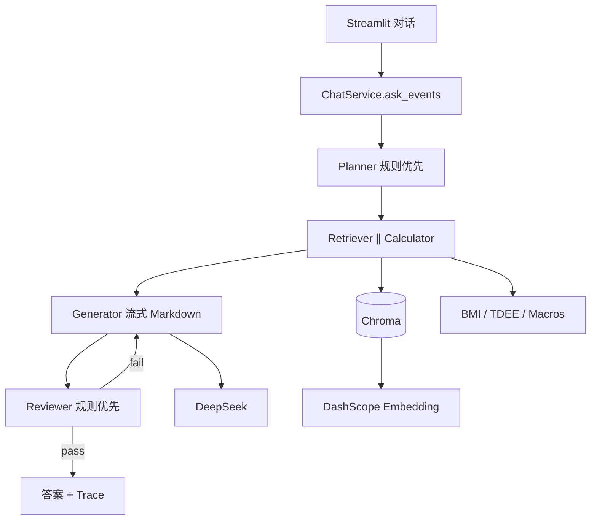

# AI 健身教练

RAG + 多 Agent（LangGraph）健身/营养咨询系统。对话优先：身高体重在聊天里说即可，支持多轮追问；数值由 Python 工具计算，LLM 负责解读与建议。

> 仅供健身营养参考，不构成医疗建议。

## 核心功能

- **对话优先**：会话档案自动累积；追问可接「那碳水呢」
- **5 Agent**：规划 → 检索 ∥ 计算 → 生成 → 评审（失败可重试）
- **思考过程可视**：侧边栏展示各步是否走 LLM、耗时、来源
- **规则优先降本**：Planner/Reviewer `auto` 模式，常见问句约 1 次 LLM
- **私人知识库**：Chroma + 规范文档；管理员 `?admin=1` 入库
- **成本可控评测**：50 条检索全量 + RAGAS-lite 抽样

## 技术架构



在线路径为 `ask_events`（与 LangGraph `build_workflow` 同构：planner → parallel_fetch → generator → reviewer）。

## 目录结构

```
health-assistant/
├── app/                 # Streamlit（chat_panel / source_viewer）
├── config/              # settings、prompts、Secrets 引导
├── src/health_assistant/
│   ├── agents/          # 5 Agent
│   ├── graph/           # LangGraph 定义
│   ├── rag/             # 入库 / 检索 / eval / ragas_lite
│   ├── services/        # ChatService、IngestService
│   ├── tools/           # BMI、TDEE、宏量
│   └── utils/           # LLM、历史、trace
├── data/raw/ + chroma/  # 知识库与预构建向量库
├── scripts/             # ingest / eval-suite / benchmark
└── docs/                # 架构、部署、评测报告
```

## 快速开始

```bash
cd health-assistant
python -m venv .venv && .venv\Scripts\activate   # Windows
pip install -r requirements-local.txt            # Cloud 用 requirements.txt
cp .env.example .env                             # 填 DEEPSEEK / DASHSCOPE
python main.py ingest
python main.py streamlit                         # http://localhost:8501
```

| 命令 | 说明 |
|------|------|
| `python main.py eval-suite` | 50 检索 + 8 条 RAGAS-lite |
| `python main.py benchmark` | E2E / 优化对比 |
| URL `?admin=1` | 管理员重建知识库 |

Streamlit Cloud：Main file=`app/streamlit_app.py`，Secrets 见 `.streamlit/secrets.toml.example`，详见 [部署指南](docs/deployment.md)。

## 性能指标（实测）

| 指标 | MVP | optimized_v1 / 最新 |
|------|-----|---------------------|
| E2E 平均延迟 | 46.5 s | **8.9 s** |
| LLM 调用/问 | 3 | **1** |
| Recall@5（50 条） | — | **100%** |
| Recall@1 / MRR（50 条） | — | **98% / 0.99** |
| Faithfulness（抽样 8） | — | **0.96** |

来源：`docs/benchmarks/mvp_vs_optimized_v1_report.md`、`eval_v1_cost_controlled_report.md`。

## 优化历程

1. **MVP**：串行 3 次 LLM，E2E ~46s  
2. **optimized_v1**：规则短路 + 检索合并 + 并行检索/计算 + 流式生成 → ~8.9s、1 次 LLM  
3. **产品化**：对话优先、多轮记忆、Agent Trace、Cloud 适配  
4. **评测**：50 条场景集 + 成本可控 RAGAS-lite  

## 后续规划

| 版本 | 方向 |
|------|------|
| v2 | 会话持久化（checkpoint）、可选 PGVector、训练计划结构化输出 |
| v3 | 更完整 RAGAS/人工标注集、LangSmith 在线评估、API 服务化 |

## 文档

<<<<<<< HEAD
- [架构说明](docs/architecture.md)
- [Agent 设计](docs/agent_design.md)
- [部署指南](docs/deployment.md)
- [MVP 基线性能报告](docs/benchmarks/mvp_baseline_report.md)
- [optimized_v1 报告](docs/benchmarks/optimized_v1_report.md)
- [MVP vs optimized_v1 对比](docs/benchmarks/mvp_vs_optimized_v1_report.md)

## RAG 评估基准（MVP）

运行 `python main.py benchmark` 生成报告，核心指标：

- **Recall@1 / @3 / @5**：检索命中率
- **MRR**：平均倒数排名
- **E2E 延迟**：多 Agent 全链路耗时

评估数据集：[tests/fixtures/eval_queries.json](tests/fixtures/eval_queries.json)（15 条标注 query）

## 示例 Query

**输入**：「我身高172，体重70，想增肌，每天吃多少蛋白质？」

**输出要点**：
- BMI 23.7（normal）
- 蛋白质建议 112～154 g/天（1.6～2.2 g/kg）
- 引用膳食指南与运动营养文献
- 评审通过后返回答案
=======
- [架构说明](docs/architecture.md) · [Agent 设计](docs/agent_design.md) · [部署](docs/deployment.md) · [面试指南](docs/interview_guide.md) · [评测](docs/benchmarks/README.md)
>>>>>>> 6f7c42d (V1.1 feat: Streamlit Cloud 适配与 Agent 思考过程展示)

## License

MIT
