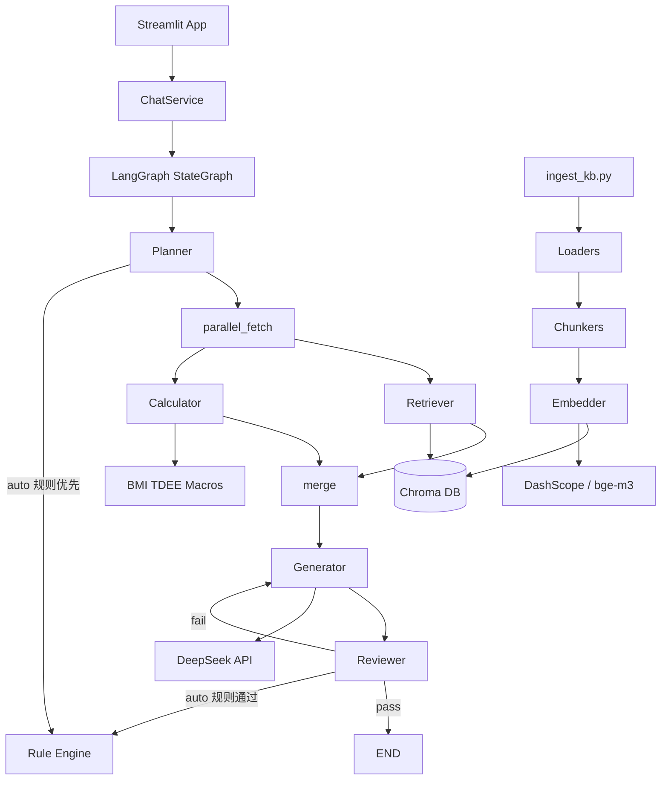

# 架构说明

## 系统概览

个人健康管理助手采用分层架构：前端 → 服务层 → LangGraph 编排 → Agent/RAG/工具。

## 核心模块

### 1. LangGraph 工作流（optimized_v1）

- **State**: `HealthState` TypedDict，保存 query、profile、plan、chunks、calculations 等
- **节点**: planner → **parallel_fetch**（retriever ∥ calculator）→ generator → reviewer
- **条件边**: reviewer 失败时回到 generator（最多 `MAX_REVIEW_RETRIES` 次）
- **Agent 复用**: `nodes.py` 模块级 `_agent_pool` 避免每节点重建实例

### 2. 降本短路（Rule-First）

| 配置项 | 默认 | 说明 |
|--------|------|------|
| `PLANNER_USE_LLM` | `auto` | 意图明确时跳过 LLM，仅模糊 query 调用 |
| `REVIEWER_USE_LLM` | `auto` | 规则检查通过即 pass，不调 LLM |
| `RETRIEVAL_MERGE_QUERIES` | `true` | 多条检索词合并为单次 embedding |

预期效果：LLM 调用从 3 次/问降至 **1 次/问**（仅 Generator）。

### 3. RAG 管道

1. `loaders.py` — 加载 PDF/Markdown/CSV
2. `chunkers.py` — 512 token 切块，64 overlap
3. `embedder.py` — DashScope v4 或本地 bge-m3
4. `vectorstore.py` — Chroma 持久化
5. `retriever_chain.py` — 单次主 query 检索 + metadata 过滤

### 4. 确定性工具

| 工具 | 说明 |
|------|------|
| `calculate_bmi` | BMI 计算 |
| `calculate_tdee` | Mifflin-St Jeor 公式 |
| `calculate_protein_range` | 按目标 1.6-2.2 g/kg 等 |

### 5. 体验层（Streamlit）

- `ChatService` **会话单例**：`st.session_state.chat_service` 复用已编译 Graph
- `ask_stream()`：规划 + 并行检索/计算完成后，Generator **流式输出**
- 侧边栏在流式完成后刷新计算/来源/评审面板

## 数据流（示例）

用户输入 → Planner（规则优先）→ Retriever ∥ Calculator 并行 → Generator 流式合成 → Reviewer（规则优先）→ 返回 `HealthResponse`

## MVP vs optimized_v1 对比

| 指标 | MVP | optimized_v1 |
|------|-----|--------------|
| 图拓扑 | 串行 5 节点 | planner → 并行 fetch → generator → reviewer |
| LLM 调用/问 | 3 次 | 1 次（auto 模式） |
| Embedding/问 | 2～3 次 | 1 次 |
| 首字可见 | ~全链路延迟 | ~2～3s（流式） |
| Graph 重建 | 每条消息 | 会话单例 |

详见 [docs/benchmarks/mvp_vs_optimized_v1_report.md](benchmarks/mvp_vs_optimized_v1_report.md)。

## 升级路径

| 阶段 | 改进 |
|------|------|
| MVP | Chroma + DeepSeek + Streamlit |
| **optimized_v1** | 规则短路 + 并行 + 流式 |
| v2 | PGVector + 用户档案 SQL JOIN |
| v3 | FlashRank 重排序 + LangSmith Eval |

## 技术选型摘要

详见项目根目录 README。核心决策：LangGraph（多 Agent 循环 + 并行 fan-out）、Chroma（零运维 MVP）、DeepSeek + DashScope（国内可用双 Provider）。
