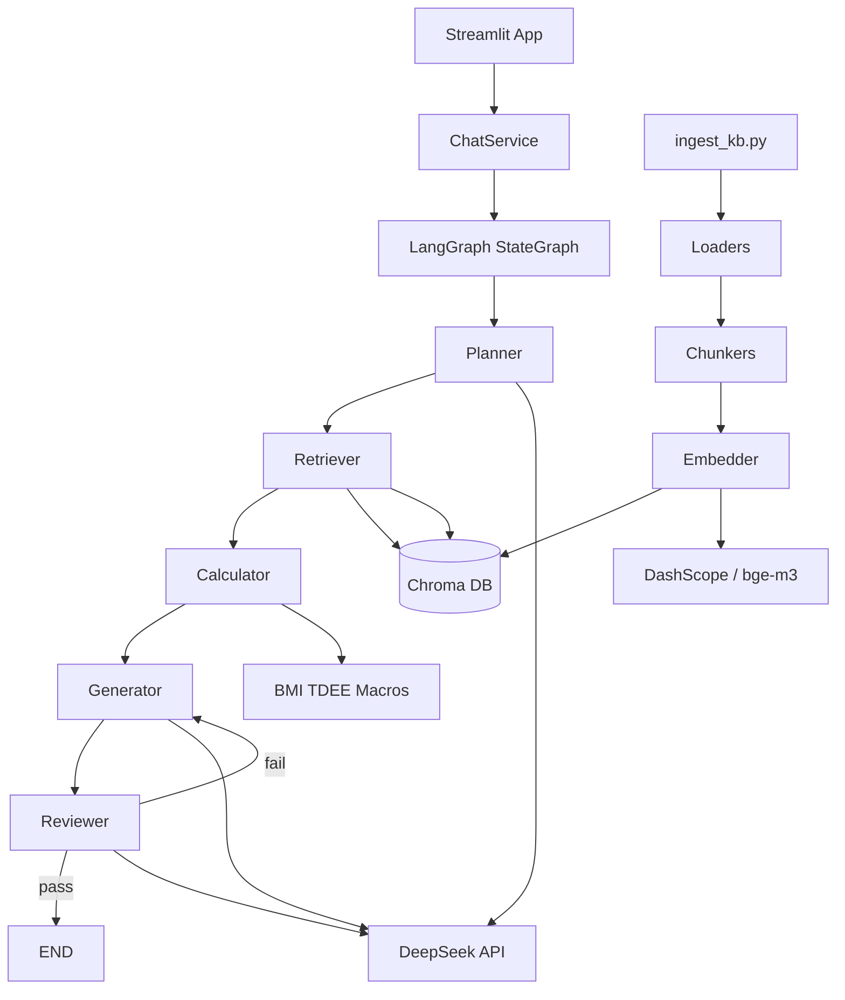

# 架构说明

## 系统概览

个人健康管理助手采用分层架构：前端 → 服务层 → LangGraph 编排 → Agent/RAG/工具。

## 核心模块

### 1. LangGraph 工作流

- **State**: `HealthState` TypedDict，保存 query、profile、plan、chunks、calculations 等
- **节点**: planner → retriever → calculator → generator → reviewer
- **条件边**: reviewer 失败时回到 generator（最多 `MAX_REVIEW_RETRIES` 次）

### 2. RAG 管道

1. `loaders.py` — 加载 PDF/Markdown/CSV
2. `chunkers.py` — 512 token 切块，64 overlap
3. `embedder.py` — DashScope v4 或本地 bge-m3
4. `vectorstore.py` — Chroma 持久化
5. `retriever_chain.py` — 多 query 检索 + metadata 过滤

### 3. 确定性工具

| 工具 | 说明 |
|------|------|
| `calculate_bmi` | BMI 计算 |
| `calculate_tdee` | Mifflin-St Jeor 公式 |
| `calculate_protein_range` | 按目标 1.6-2.2 g/kg 等 |

## 数据流（示例）

用户输入 → Planner 拆解 → Retriever 从 Chroma 取片段 → Calculator 算 BMI/蛋白质 → Generator 合成建议 → Reviewer 核验 → 返回 `HealthResponse`

## 升级路径

| 阶段 | 改进 |
|------|------|
| MVP | Chroma + DeepSeek + Streamlit |
| v2 | PGVector + 用户档案 SQL JOIN |
| v3 | FlashRank 重排序 + LangSmith Eval |

## 技术选型摘要

详见项目根目录 README。核心决策：LangGraph（多 Agent 循环）、Chroma（零运维 MVP）、DeepSeek + DashScope（国内可用双 Provider）。
