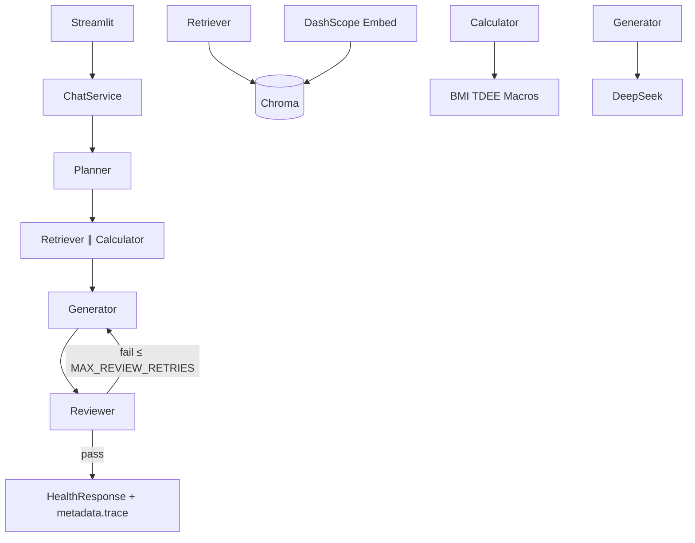

# 架构说明

## 定位

**AI 健身教练**：对话优先的多 Agent 健身/营养咨询。用户在聊天中提供身高体重与目标；系统检索私人知识库、用工具计算 BMI/TDEE/宏量，再生成可引用建议并由评审门禁把关。

## 运行时数据流

在线 UI 走 `ChatService.ask_events`（支持流式 Token、Agent Trace、会话档案更新）。拓扑与 LangGraph `build_workflow` 一致：

### 多轮与档案

- `messages` 保存在 `st.session_state`，本轮前历史传入 Planner/Generator。
- Planner 抽取实体后 `UserProfile.merge_from_entities`，写入侧边栏「会话档案」。
- 追问无身高体重时，从历史用户句与会话档案补全。

## 模块边界

| 层 | 路径 | 职责 |
|----|------|------|
| UI | `app/` | 对话吸底输入、侧边栏 Trace/计算/来源；`?admin=1` 入库 |
| Service | `services/chat_service.py` | 编排入口、`ask_events` |
| Agents | `agents/` | 规划 / 检索 / 计算 / 生成 / 评审 |
| Graph | `graph/` | LangGraph 同构定义（可扩展 checkpointer） |
| RAG | `rag/` | 加载切块嵌入、检索、Recall 评测、RAGAS-lite |
| Tools | `tools/` | 确定性营养计算 |

## 降本配置（optimized_v1）

| 配置 | 默认 | 作用 |
|------|------|------|
| `PLANNER_USE_LLM` | `auto` | 明确意图跳过 Planner LLM |
| `REVIEWER_USE_LLM` | `auto` | 规则通过即 pass |
| `RETRIEVAL_MERGE_QUERIES` | `true` | 单次 Embedding 检索 |
| `EMBEDDING_PROVIDER` | `dashscope` | Cloud 推荐，避免本地下载大模型 |

## 升级路径

| 版本 | 内容 |
|------|------|
| MVP | 串行多 LLM + Streamlit |
| **optimized_v1** | 规则短路、并行、流式、评测对比 |
| 当前 | 对话优先、多轮、Trace、50 条评测 + RAGAS-lite、Cloud |
| v2 | Checkpoint 持久会话、PGVector、结构化训练计划 |
| v3 | 更全评估集、LangSmith Eval、FastAPI |

## 相关报告

- [MVP vs optimized_v1](benchmarks/mvp_vs_optimized_v1_report.md)
- [50 条成本可控评测](benchmarks/eval_v1_cost_controlled_report.md)
