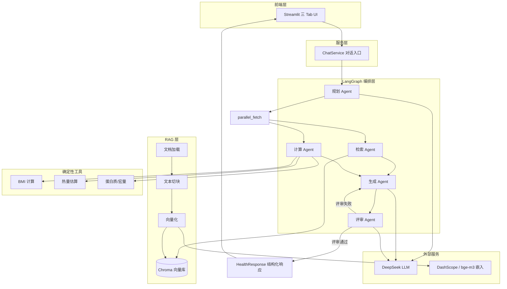
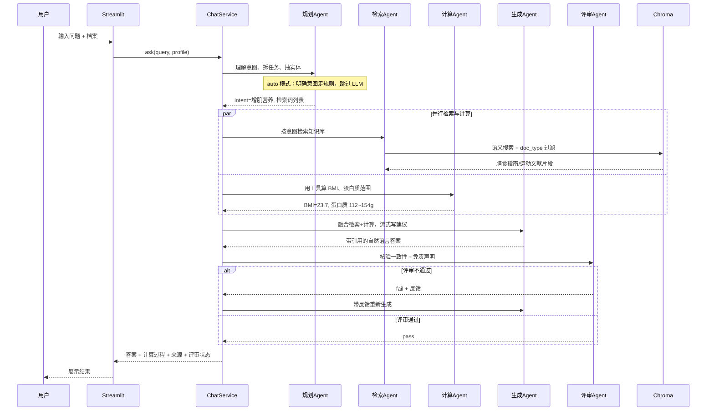

# 个人健康管理助手 — 项目面试答辩指南

> 适用场景：AI 应用开发 / RAG / Agent 方向面试，3～5 分钟项目介绍 + 追问应对

---

## 一、30 秒电梯演讲（开场必背）

这是一个 **RAG + 多 Agent 协作** 的健康问答系统。用户提问后，系统不会直接让大模型「瞎编」，而是先 **规划任务**、从私有知识库 **检索权威资料**、用 Python **精确计算** BMI/蛋白质等数值，再 **生成建议**，最后由 **评审 Agent 核验** 是否与来源和计算结果一致。技术栈是 **LangGraph + Chroma + DeepSeek + Streamlit**，面向国内可部署、可 Demo、可测试。

---

## 二、核心架构图

### 2.1 系统总览

### 2.2 单次问答数据流（举例）

**用户问**：「我身高 172，体重 70，想增肌，每天吃多少蛋白质？」

---

## 三、逐模块一句话解释

| 模块 | 路径 | 一句话解释 |
|------|------|-----------|
| **配置中心** | `config/settings.py` | 从 `.env` 统一管理 LLM、Embedding、Chroma、RAG 参数，支持 LangSmith 追踪开关。 |
| **Prompt 模板** | `config/prompts/` | 五个 Agent 的系统提示词 YAML 化，方便调优且与代码解耦。 |
| **规划 Agent** | `agents/planner.py` | 规则优先（`PLANNER_USE_LLM=auto`）：意图明确时跳过 LLM，模糊 query 才调用。 |
| **检索 Agent** | `agents/retriever.py` | 按规划结果从 Chroma 检索权威片段，默认单次 embedding 合并检索词。 |
| **计算 Agent** | `agents/calculator.py` | 调用 Python 工具算 BMI、TDEE、蛋白质范围，**不让 LLM 做算术**。 |
| **生成 Agent** | `agents/generator.py` | 把检索内容和计算结果合成可读建议，无 API 时用模板兜底。 |
| **评审 Agent** | `agents/reviewer.py` | 规则优先（`REVIEWER_USE_LLM=auto`）：免责声明/数值一致则 pass，不调 LLM。 |
| **LangGraph 工作流** | `graph/workflow.py` | planner → parallel_fetch（检索∥计算）→ generator → reviewer，评审失败循环。 |
| **共享状态** | `graph/state.py` | `HealthState` 在各节点间传递 query、档案、计划、检索块、计算结果、评审反馈。 |
| **RAG 加载** | `rag/loaders.py` | 支持 PDF/Markdown/CSV，自动标注来源和文档类型。 |
| **RAG 切块** | `rag/chunkers.py` | 512 token 切块、64 overlap，适合中文健康文献。 |
| **向量化** | `rag/embedder.py` | 双模式：DashScope API 或本地 bge-m3，LLM 与 Embedding 解耦。 |
| **向量库** | `rag/vectorstore.py` | Chroma 持久化存储，支持按 `doc_type` metadata 过滤检索。 |
| **入库管道** | `rag/ingest.py` | 一键：加载 → 切块 → 嵌入 → 写入 Chroma。 |
| **营养工具** | `tools/` | BMI、Mifflin-St Jeor 热量、增肌蛋白质 1.6~2.2 g/kg 等确定性计算。 |
| **对话服务** | `services/chat_service.py` | 会话级 Graph 复用 + `ask_stream()` 流式生成，封装 `HealthResponse`。 |
| **Streamlit UI** | `app/` | 三 Tab：用户档案、对话咨询、知识库重建，侧边栏展示计算与来源。 |
| **测试** | `tests/` | 工具单测 + RAG 集成 + 全链路图流程（可无 API Key 运行）。 |

---

## 四、面试必问 Top 5 问答

### Q1：为什么用多 Agent，而不是一个 LLM 直接回答？

**答**：健康场景需要 **「规划 → 检索 → 计算 → 生成 → 评审」** 分工。单一 LLM 容易 **编造数值**、**缺乏引用**、**无法自检**。拆成五个角色后：检索负责「有据可查」，计算负责「数值准确」，评审负责「上线前质检」，更接近真实咨询流程，也便于调试和展示工程能力。

---

### Q2：RAG 在你项目里具体怎么工作的？

**答**：离线阶段把 `data/raw/` 下的膳食指南、运动文献、营养表 **加载 → 切块 → 向量化 → 存入 Chroma**。在线阶段规划 Agent 产出检索词，检索 Agent 做 **语义相似度搜索**，并按意图过滤文档类型（如增肌会查膳食+运动+营养表）。检索结果带 `source`、`doc_type` 等 metadata，生成 Agent 写答案时引用，评审 Agent 再对照核验。

---

### Q3：为什么计算不用 LLM，而用 Python 工具？

**答**：BMI、蛋白质 g/kg、TDEE 等有 **固定公式和行业标准范围**，必须 **可复现、可单测**。LLM 算数不稳定，面试 Demo 和单元测试都需要确定性结果。所以计算 Agent 只调 `tools/` 里的 Python 函数，生成 Agent 只负责「解读和表达」，评审 Agent 再核对答案里的数字是否和工具输出一致。

---

### Q4：LangGraph 相比普通 Chain 的优势是什么？

**答**：本项目需要 **条件分支和循环**——评审不通过要打回生成 Agent 重试（最多 2 次，由 `MAX_REVIEW_RETRIES` 控制）。LangGraph 的 `StateGraph` 能显式管理 **共享状态 `HealthState`**，每个节点的输入输出可追溯，还支持 LangSmith 追踪，比线性 Chain 更适合多 Agent 协作。

---

### Q5：没有 API Key 或网络不好，系统还能跑吗？

**答**：可以。Planner、Generator、Reviewer 都有 **规则/模板兜底**；Embedding 默认走 **本地 bge-m3**；集成测试 `test_graph_flow` 就是无 API 场景设计的。有 DeepSeek Key 时体验更好（规划更准、建议更自然、LLM 评审更细），但不是硬依赖——这是 **可降级、可 Demo** 的工程化设计。

---

## 五、项目亮点提炼（面试主动说）

### 亮点 1：RAG 与 Tool 分离 ——「该查的查，该算的算」

- 知识性问题走 RAG，数值问题走 Python 工具
- 避免 LLM「一本正经地算错」
- 体现 **Agent + Tool Calling** 思路，而不只是 Chatbot

### 亮点 2：评审闭环 —— 不是一次性生成

- 评审 Agent 检查：免责声明、蛋白质数值范围、与检索来源是否矛盾
- 失败则 **打回 Generator 重写**，最多 2 次
- 体现 **质量门禁** 和 LangGraph **cyclic graph** 能力

### 亮点 3：双 Provider 架构 —— 国内可落地

- **DeepSeek** 负责 LLM（OpenAI 兼容接口）
- **DashScope / bge-m3** 负责 Embedding（DeepSeek 无 embedding API）
- 展示 **多供应商解耦** 的真实工程问题处理

### 亮点 4：工业级目录与可测试性

- `agents/` 与 `graph/` 分离：业务 vs 编排
- Pydantic 结构化 I/O（`PlannerOutput`、`HealthResponse` 等）
- 单元测试覆盖 BMI/宏量计算，集成测试覆盖 RAG 和全链路
- 配置、Prompt、代码三层分离，便于协作和维护

### 亮点 5：可演示的产品化 UI

- Streamlit 三 Tab：档案、对话、知识库管理
- 侧边栏展示 **计算过程、检索来源、评审状态**
- 面试官能 **一眼看到 RAG 引用和多 Agent 协作结果**，比纯 CLI 更有说服力

### 亮点 6：性能优化与降本（optimized_v1）

- **规则短路**：Planner/Reviewer 在 auto 模式下跳过 LLM，常见问句仅 Generator 调 1 次 API
- **并行 fan-out**：Retriever 与 Calculator 无依赖，LangGraph `parallel_fetch` 并行执行
- **流式体验**：`ask_stream()` + `st.write_stream`，用户 2～3s 内可见首字
- **可量化对比**：`python main.py benchmark` 生成 MVP vs optimized_v1 报告

---

## 六、优化前后对比（面试数据）

| 指标 | MVP 基线 | optimized_v1 |
|------|----------|--------------|
| E2E 平均延迟 | ~46.5 s | **~8.9 s** |
| LLM 调用/问 | 3 次 | **1 次** |
| 评审 pass 率 | 67% | **100%** |
| Recall@5 / MRR | 100% / 0.97 | **100% / 1.0** |

报告路径：[docs/benchmarks/mvp_vs_optimized_v1_report.md](benchmarks/mvp_vs_optimized_v1_report.md)

---

## 七、讲解建议（时间分配）

| 阶段 | 时长 | 说什么 |
|------|------|--------|
| 背景 + 问题 | 30s | 健康问答不能瞎编，需要权威来源 + 精确计算 + 质检 |
| 架构图 | 1min | 指着 Mermaid 讲五 Agent + RAG + 工具三层 |
| Demo | 1～2min | 现场问「172/70 增肌多少蛋白质」，展示答案、112~154g、来源、评审 pass |
| 亮点 | 1min | 挑 2～3 个亮点深入，准备 Q&A |
| 改进方向 | 30s | PGVector、重排序、并行检索、FastAPI 部署（体现思考深度） |

---

## 八、可能被追问的加分回答（备用）

- **Chroma 为什么不用 PGVector？** MVP 零运维、本地 Demo 快；生产可迁 PGVector 做 SQL JOIN 用户档案。
- **chunk_size 为什么 512？** 健康文献有表格和短段落，小块召回更准；overlap 64 避免语义截断。
- **怎么评估 RAG 效果？** `python main.py benchmark` 输出 Recall@K、MRR、E2E 延迟；评估集见 `tests/fixtures/eval_queries.json`。
- **怎么降 API 成本？** Planner/Reviewer 规则优先（`auto`），检索词合并为单次 embedding，详见 optimized_v1 报告。
- **免责声明怎么保证？** 评审 Agent 规则层强制检查「仅供参考，不构成医疗建议」。

---

## 八、讲解时务必提的一句免责

> 「本系统仅供健康信息参考，不构成医疗建议；有特殊情况应咨询医生或注册营养师。」

这既符合产品合规，也体现你对 **AI 健康类应用风险** 的意识——面试官通常会加分。
